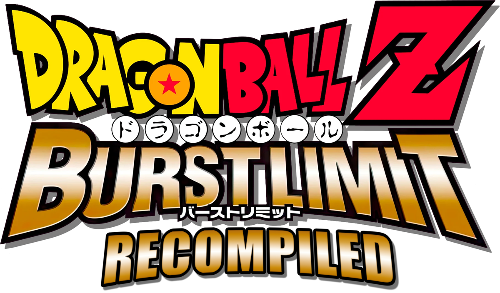

<p align="center">
  
</p>

# Dragon Ball Z: Burst Limit Recompiled

A static recompilation of **Dragon Ball Z: Burst Limit** (Xbox 360) to native Windows x64, built on the
[ReXGlue](https://github.com/rexglue/rexglue-sdk) recompiler/runtime.

The game's PowerPC code is translated ahead of time into C++ and compiled with Clang, so it runs as a
normal Windows program instead of inside an emulator.

> **This repository contains no game data.** You need your own legally obtained copy of the game.

---

## Features

- **Native x64 build** of the game code (no JIT), Direct3D 12 renderer.
- **In-game settings menu**: **F1**, or **Back + Start** on the controller. Resolution, upscaler, frame rate,
  field of view, post effects, free camera and more; changes apply right away and are saved to `burstlimit.toml`.
- **Frame rate cap** (`frame_rate`): 30 (the original), 60, 120, 144 or unlocked, with fixes for pause, quitting
  a match and Training's "Reset Standing Position" above 30 FPS.
- **Resolution and upscaling**: internal resolution up to 4K and beyond, changeable while playing; AMD FSR 1/2/3
  and CAS sharpening, FXAA, anisotropic filtering.
- **Field of view** option (`field_of_view`, 50-200 %), applied where the game builds its projection, so
  the effects it places on the screen (flares, speed lines, distortions) stay on the fighters.
- **Cleaner image at high resolution**: the game's depth of field, glow blur and motion blur sample at fixed 720p
  distances, which leaves halos and ghost copies around the characters above 720p. They are off by default and
  can be turned back on (`depth_of_field`, `glow_blur`, `motion_blur`).
- **Start transformed**: on the character select, **RB / LB** pick the form a character starts the match in
  (Super Saiyan Goku, Final Form Frieza, Perfect Cell, ...), shown in a tag under its name with the form's face.
  Works in Versus and Training; Z Chronicles battles keep their own forms. Offline only for now: online
  matches keep the normal forms, as the other player's console wouldn't know the choice.
- **Free camera / photo mode** (`free_camera`): fly the camera anywhere, also while paused, hide the HUD, zoom
  and tilt.
- **FPS panel** (F3): frame rate, frame time graph, render resolution and upscaler, in any corner.
- **Online play over LAN / Radmin VPN**: Xbox LIVE sign-in, session create/search/join and player matches,
  emulated on top of plain UDP.
- **Low-latency online** (`online_fast_tick`, `online_tick_sleep`): the game's match driver normally only runs
  every 4th frame and sends input in 12-frame batches (~1 second of input delay even on LAN). The patch makes the
  step configurable; the default (`online_tick_sleep = 1`) cuts the delay to about a tenth without slow motion
  over the internet.
- **Texture dumping / replacement** (`texture_dump_enabled`, `texture_replace_enabled`): put a texture pack in
  `textures\replace` and turn on **Texture pack** in the settings menu. Replacements get mipmaps and are decoded
  in the background at startup, so they don't stutter the game when first used.
- Optional **Discord Rich Presence**.

---

## Download (no build needed)

Grab the latest **alpha** from the [Releases page](https://github.com/iExplosiveRage/DBZ-Burst-Limit-Recompiled/releases):

1. Download `DBZ-Burst-Limit-Recompiled-*.zip` and extract it anywhere.
2. Copy your extracted game files into the `game_data_root` folder inside it (see [Game files](#game-files)).
3. Run `burstlimit.exe`.

Building from source (below) is only needed if you want to change the code.

### Linux / Steam Deck
Download `DBZ-Burst-Limit-Recompiled-*-linux.zip` instead: the same build with
[vkd3d-proton](https://github.com/HansKristian-Work/vkd3d-proton) and [DXVK](https://github.com/doitsujin/dxvk)
(Direct3D 12 to Vulkan) next to it and a `run_linux.sh` launcher for Wine. Put your game files in
`game_data_root` and run `./run_linux.sh`. Steam / Proton works too: add `burstlimit.exe` as a non-Steam game
and force Proton Experimental in its Compatibility settings.

---

## Requirements

### To play
- Windows 10/11 x64
- A GPU with Direct3D 12 support
- Your own copy of Dragon Ball Z: Burst Limit (Xbox 360), extracted to a folder (see [Game files](#game-files))

### To build
| Tool | Version | Notes |
|---|---|---|
| [Visual Studio 2022](https://visualstudio.microsoft.com/) | 17.x | Install the **Desktop development with C++** workload (for the Windows SDK and linker). |
| [LLVM / Clang](https://github.com/llvm/llvm-project/releases) | 20 or newer (tested with 21.1) | `clang` / `clang++` must be on `PATH`. |
| [CMake](https://cmake.org/download/) | 3.25 or newer | |
| [Ninja](https://github.com/ninja-build/ninja/releases) | 1.11 or newer | Must be on `PATH`. |
| [Git](https://git-scm.com/) | any recent | Needed for the SDK submodule. |

About 15 GB of free disk space is needed for the SDK dependencies and build output. A full first build takes
10–30 minutes depending on your CPU.

---

## Getting the source

```bat
git clone --recursive https://github.com/iExplosiveRage/DBZ-Burst-Limit-Recompiled.git
cd DBZ-Burst-Limit-Recompiled
```

If you cloned without `--recursive`:

```bat
git submodule update --init --recursive
```

The ReXGlue SDK lives in `thirdparty/rexglue-sdk` (branch `burstlimit` of
[iExplosiveRage/rexglue-sdk](https://github.com/iExplosiveRage/rexglue-sdk)). It contains the Burst Limit
specific runtime changes (online, settings menu, upscalers, frame pacing, texture replacement, overlay,
codegen fixes).

---

## Game files

Extract your copy of the game (for example with `extract-xiso`) and copy it into a folder called
`game_data_root` at the root of this repository:

```
DBZ-Burst-Limit-Recompiled/
└─ game_data_root/
   ├─ default.xex
   └─ LONG2DATA/
      ├─ LONG2DATA_US.CPK
      ├─ STREAM_US.CPK
      ├─ STREAM_JP.CPK
      ├─ SFD/
      └─ SOUND/
```

`default.xex` is needed at **build time** (the recompiler reads it) and the whole folder is needed at
**run time**.

---

## Building

From a normal command prompt in the repository folder:

```bat
build.bat
```

`build.bat` will:
1. Find Visual Studio 2022 and set up the x64 build environment.
2. Fix the symlinks inside the SDK's `libmspack` submodule (Git for Windows checks them out as text files).
3. Configure with the `win-amd64-relwithdebinfo` CMake preset.
4. Run the recompiler (generates `generated/default/*.cpp` from `default.xex`).
5. Build `out\build\win-amd64-relwithdebinfo\burstlimit.exe`.

To build manually instead:

```bat
cmake --preset win-amd64-relwithdebinfo
cmake --build out\build\win-amd64-relwithdebinfo --target burstlimit_codegen
cmake out\build\win-amd64-relwithdebinfo
cmake --build out\build\win-amd64-relwithdebinfo --target burstlimit
```

Other presets: `win-amd64-debug`, `win-amd64-release`.

> **Note:** the recompiler only re-runs when the manifest or the game executable changes. If you change the
> SDK's code generator, delete `generated/default` before building.

### Optional: AMD FSR 2 / FSR 3
FSR 1 and CAS are always built in. FSR 2 and FSR 3 need the AMD FidelityFX SDK, which needs the
[Vulkan SDK](https://vulkan.lunarg.com/) 1.3.250 or newer installed. Configure with:

```bat
cmake --preset win-amd64-relwithdebinfo -DREXGLUE_ENABLE_FIDELITYFX=ON
```

The build copies `amd_fidelityfx_dx12.dll` next to `burstlimit.exe`; keep it there.

### Optional: Discord Rich Presence
Download the Discord Social SDK and configure with:

```bat
cmake --preset win-amd64-relwithdebinfo -DDISCORD_SDK_ROOT=C:/path/to/discord_social_sdk
```

---

## Running

```bat
run.bat
```

This starts `out\build\win-amd64-relwithdebinfo\burstlimit.exe` with `game_data_root` from the repository.
You can also copy `burstlimit.exe` and the `.dll` files from the build folder next to a `game_data_root`
folder and run it directly.

Settings are stored in `burstlimit.toml` (see `burstlimit.toml.example`). Most of them can be changed in the
settings menu (F1). Any setting can also be passed on the command line, e.g. `--frame_rate=60`.

### Controls
- An Xbox-compatible controller works out of the box.
- Keyboard: start with `--mnk_mode=true` (Space = A, Backspace = B, Enter = Start, WASD = move).
- **F1** or **Back + Start**: settings menu (the buttons can be changed to L3 + R3 in the menu). **Y** in the
  menu turns the free camera on or off.
- **F3**: FPS panel.
- Character select: **RB / LB** change the start form (transformation), next to **Y** (Change Color).
- Free camera: left stick moves, right stick looks, LB/RB down/up, LT/RT slower/faster, D-pad up/down zoom,
  D-pad left/right tilt, A hides the HUD, Y resets, B exits. Pause the game first for a photo mode.
- Input only goes to the focused window.

---

## Settings

| Setting | Default | Description |
|---|---|---|
| `frame_rate` | *(empty)* | Frame rate cap: `30` (the original), `60`, `120`, `144` or `unlocked`. Empty = from `patch_60fps` and `vsync` (older settings). |
| `draw_resolution_scale_x/y` | `1` | Internal resolution scale: `1` = 720p, `2` = 1440p, `3` = 4K (sharper, heavier). |
| `present_effect` | `bilinear` | `bilinear` (off), `cas` (sharpening), `fsr`, `fsr2`, `fsr3` (AMD FSR upscaling). |
| `present_fsr_quality_mode` | `auto` | How far below the resolution FSR renders: `auto` (native), `nativeaa`, `quality`, `balanced`, `performance`, `ultra_performance`. |
| `field_of_view` | `100` | Field of view in percent of the original (50-200). |
| `depth_of_field` | `false` | Blurs the background behind the fighters. |
| `glow_blur` | `false` | Soft glow blur (leaves a halo around the characters at high resolution). |
| `motion_blur` | `false` | Directional blur during fast moves. |
| `free_camera` | `false` | Free camera (always off at startup). |
| `quick_menu_buttons` | `back+start` | Controller buttons for the settings menu: `back+start`, `l3+r3` or `none` (F1 always works). |
| `debug_overlay` | `false` | FPS panel (F3). |
| `debug_overlay_position` | `top-left` | `top-left`, `top-right`, `bottom-left` or `bottom-right`. |
| `patch_60fps` | `false` | Older 60 FPS setting, only used while `frame_rate` is empty. |
| `online_fast_tick` | `true` | Uses `online_tick_sleep` for the online match driver instead of the game's original 4-frame step. **Both players must use the same value.** |
| `online_tick_sleep` | `1` | Online input buffer: `0` = same PC / LAN, `1` = internet (recommended), `2` = high ping, `3` = original game (~1 s delay). Lower = less delay, but slow motion appears if the connection cannot keep up. **Both players must use the same value.** |
| `online_input_delay_test` | `true` | Resends unacknowledged online messages every 2 ticks instead of 6. |
| `vsync` | `true` | Older frame rate setting, only used while `frame_rate` is empty (`false` = unlocked). |
| `texture_dump_enabled` | `false` | Dump textures to `textures/dump`. |
| `texture_replace_enabled` | `false` | Load replacements from `textures/replace` (next to the exe). |
| `texture_replace_preload` | `true` | Decode all the replacements in the background at startup, so they don't stutter the game when first used (keeps them in RAM). |
| `texture_folder` | *(exe folder)/textures* | Override the textures folder. |
| `log_level` | `info` | `debug` / `info` / `warning` / `error`. |

---

## Online play (Radmin VPN / LAN)

Both players need the **same build** of this project.

1. Install [Radmin VPN](https://www.radmin-vpn.com/) and join the same network (or use a normal LAN).
2. **Host:** run `scripts\Host_Online.bat`, enter your own Radmin IPv4, then create a Player Match session.
3. **Join:** run `scripts\Join_Online.bat`, enter your own Radmin IPv4 and then the host's IPv4, then search
   for a Player Match session.

The game uses UDP port **1000**. Allow `burstlimit.exe` through Windows Firewall if the other player cannot
connect.

Environment variables used by the online layer:

| Variable | Meaning |
|---|---|
| `REX_XNET_IP` | Your IPv4 address (reported to the game as your Xbox LIVE address). |
| `REX_XNET_SEARCH_IP` | Joining side: the host's IPv4 (the session search returns this lobby). |
| `REX_XNET_BIND_IP` | Optional: bind the game's sockets to this local address only. |

### Testing online on one PC
`scripts\Local_Online_Test.bat` starts two copies of the game (host on `127.0.0.1`, join on `127.0.0.2`).
Switch between the windows with Alt+Tab; the controller follows the focused window.

---

## Known issues

- Online play has only been tested on LAN / Radmin VPN, not over the public internet without a VPN.
- A wider field of view can show missing objects at the edges of the screen: the game doesn't draw what it
  doesn't expect to be seen.
- FSR 2 and FSR 3 can leave trails behind moving characters, as the game has no motion vectors for them.
- Linux has been tested through vkd3d-proton and DXVK (the translation Proton uses) on NVIDIA and AMD GPUs, but
  not on a Linux machine yet. Wine's own Direct3D 12 (plain Wine without vkd3d-proton) isn't supported - use
  the Linux zip or Proton.
- The Xbox LIVE friends list and leaderboards are not implemented.
- Running two copies on one PC (local online test) can drop frames on slower machines.

---

## Project layout

| Path | Contents |
|---|---|
| `burstlimit_manifest.toml` | Recompiler manifest: entry point, extra functions and mid-asm hooks (game patches). |
| `src/burstlimit_patches.cpp` | Implementation of the game patches (frame rate, online latency, post effects, field of view). |
| `src/burstlimit_camera.cpp` | Free camera / photo mode. |
| `src/burstlimit_app.h`, `src/main.cpp` | Application entry point and the settings menu. |
| `res/` | Application icon (embedded into the exe). |
| `generated/rexglue.cmake` | ReXGlue build glue. `generated/default/` is produced by the build. |
| `thirdparty/rexglue-sdk` | ReXGlue SDK (submodule, `burstlimit` branch). |
| `scripts/` | Online launch helpers. |

Game changes are made with `[[entrypoint.midasm_hook]]` entries in the manifest, never by editing the
generated code (it is regenerated on every build).

---

## Credits

- [ReXGlue SDK](https://github.com/rexglue/rexglue-sdk) - the recompiler and runtime this project is built on.
- [Xenia](https://github.com/xenia-project/xenia) - the Xbox 360 emulator whose kernel and GPU work ReXGlue builds on.
- Dragon Ball Z: Burst Limit © Bird Studio/Shueisha, Toei Animation. Published by Bandai Namco Games.

## Disclaimer

This project is not affiliated with or endorsed by Bandai Namco, Microsoft or any rights holder. It does not
include any game assets; you must own the game to use it.
